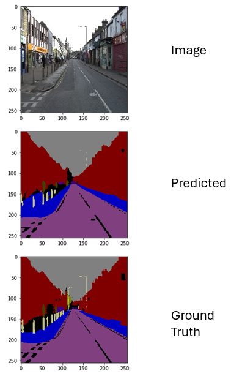

# Semantic Segmentation for Autonomous Driving



This repository contains semantic segmentation experiments using **DeepLabV3+** (TensorFlow/Keras) with **ResNet18** and **ResNet50** backbones. The notebooks cover training and evaluation on **CamVid** and **Cityscapes**.

This project was completed as a **capstone project** for the course **Introduction to Deep Learning**, taught by **Dr. Stephen Scott** at the **University of Nebraska-Lincoln (UNL)** in **Spring 2022**.

## Report

The project report is available at:

- `docs/report.pdf`

## Installation

Install dependencies using:

```bash
pip install -r requirements.txt
